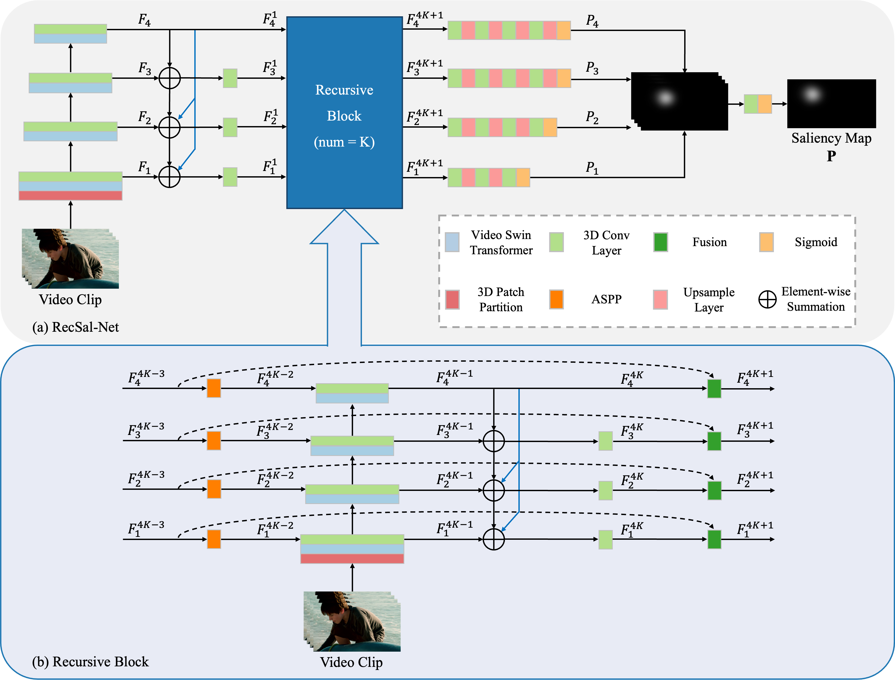

# RecSal-Net

This repository provides the official implementation of RecSal-Net, introduced in our paper:

ChaeEun Woo, SuMin Lee, Soo Min Park, and Byung Hyung Kim,
“RecSal-Net: Recursive Saliency Network for Video Saliency Prediction,” Neurocomputing, 2025. [[pdf]](https://drive.google.com/file/d/1ORnd-DOUdnswFdbK5MxwNlGsBUKuQLLY) [[link]](https://www.sciencedirect.com/science/article/pii/S0925231225014948) 


RecSal-Net is a recursive transformer architecture that integrates a transformer-based encoder with a recursive feature integration mechanism, specifically designed for the task of Video Saliency Prediction (VSP).

# Network structure of RecSal-Net

<div align="center">


Fig.1 RecSal-Net structure
</div>

The overall architecture of RecSal-Net. (a) The RecSal-Net model, including a transformer-based encoder, recursive blocks, and a decoder. (b) The recursive block, which iteratively refines multi-scale spatiotemporal features.

# Prepare the Python virtual environment

Please create an Anaconda virtual environment by:

> $ conda create -n RS python=3.8 -y

Activate the virtual environment by:

> $ conda activate RS

Install the requirements by:

> $ pip3 install -r requirements.txt

# Run the code

Please download the pre-trained VST [here](https://github.com/Zhongdao/Video-Swin-Transformer) and the DHF1K dataset [here](https://github.com/wenguanwang/DHF1K).

<pre>
Project/
│
├── saved_models/
│   └── RecSalNet.pth
│
├── data/
│   └── DHF1K/
│       ├── train/
│       └── val/
│
├── dataloader.py
├── loss.py
├── model.py
├── swin_transformer.py
├── test.py
├── train.py
├── utils.py
├── requirements.txt
└── swin_small_patch244_window877_kinetics400_1k.pth
</pre>

You can run the code by:
> $ python3 train.py

The results will be saved in a folder named saved_models.

After you finish all the training processes, you can use test.py to generate the predicted saliency maps and compute all evaluation metrics by:
> $ python3 test.py

# Resurt
Table 1. Quantitative comparison on DHF1K dataset.
||AUC_J↑|SIM↑|s-AUC↑|CC↑|NSS↑|
|:-|:-:|:-:|:-:|:-:|:-:|
|DeepVS|0.856|0.256|0.583|0.344|1.911|
|ACLNet|0.890|0.315|0.601|0.434|2.354|
|SalEMA|0.890|**0.466**|0.667|0.449|2.574|
|STRA-Net|0.895|0.355|0.663|0.458|2.558|
|TASED-Net|0.895|0.361|0.712|0.470|2.667|
|Chen et al.|0.900|0.353|0.680|0.476|2.685|
|SalSAC|0.896|0.357|0.697|0.479|2.673|
|UNISAL|0.901|0.390|0.691|0.490|2.776|
|HD2S|0.908|0.406|0.700|0.503|2.812|
|ViNet|0.908|0.381|**0.729**|0.511|2.872|
|ECANet|0.903|0.385|0.717|0.500|2.814|
|TSFP-Net|0.912|0.392|0.723|0.517|2.967|
|STSANet|**0.913**|0.383|0.723|0.529|3.010|
|GFNet|**0.913**|0.379|0.723|0.529|2.995|
|**Ours**|**0.913**|0.414|0.728|**0.547**|**3.135**|

# Cite

Please cite our paper if you use our code in your own work:
```
@article{woo2025recsal,
  title={RecSal-Net: Recursive Saliency Network for video saliency prediction},
  author={Woo, ChaeEun and Lee, SuMin and Park, Soo Min and Kim, Byung Hyung},
  journal={Neurocomputing},
  pages = {130822},
  year={2025},
  volume={650}
}

```
